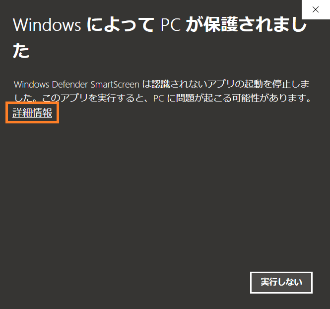
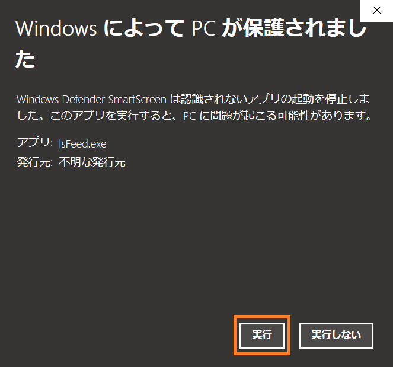
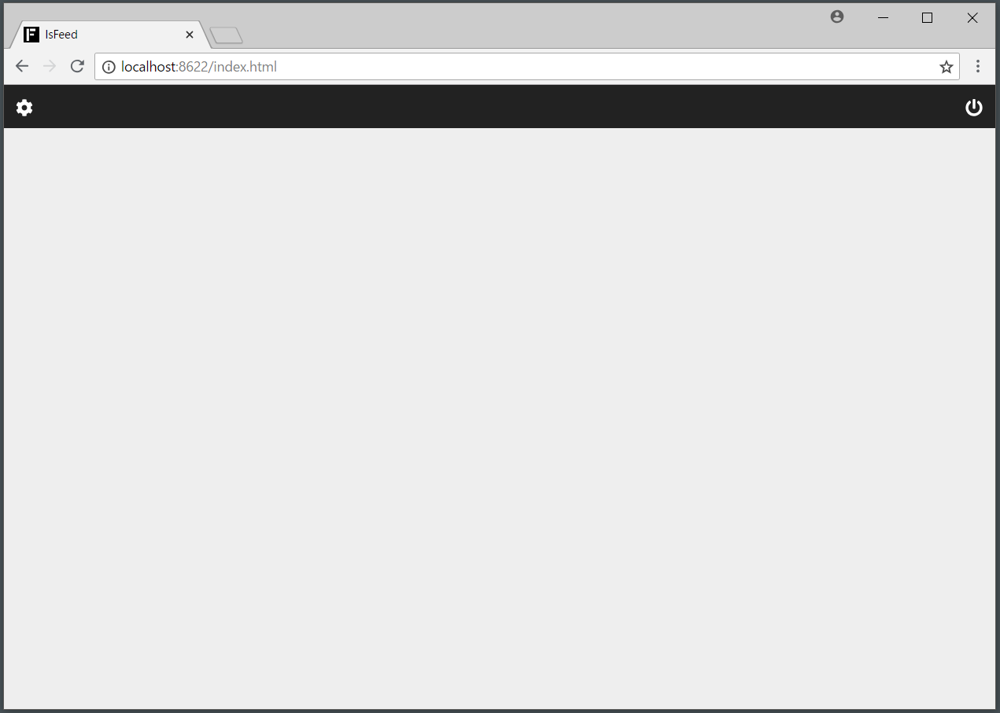
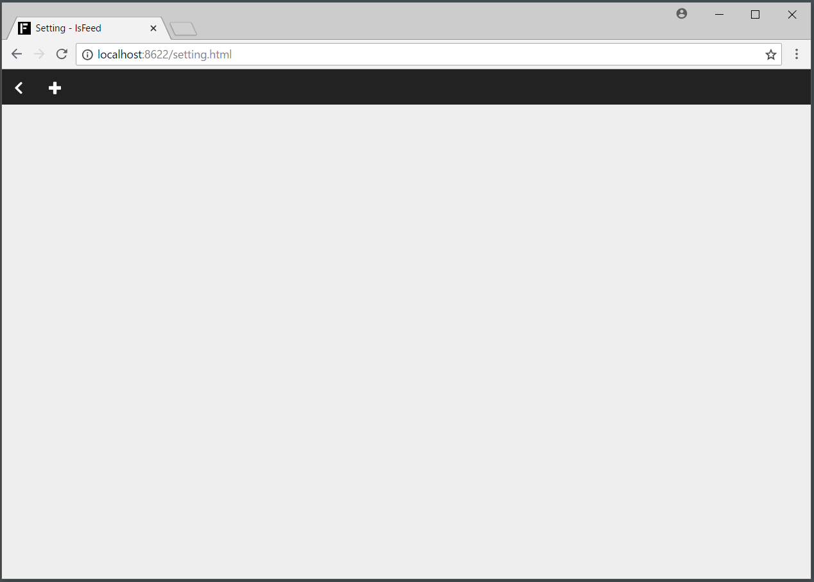
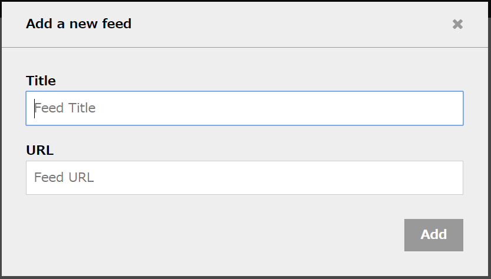
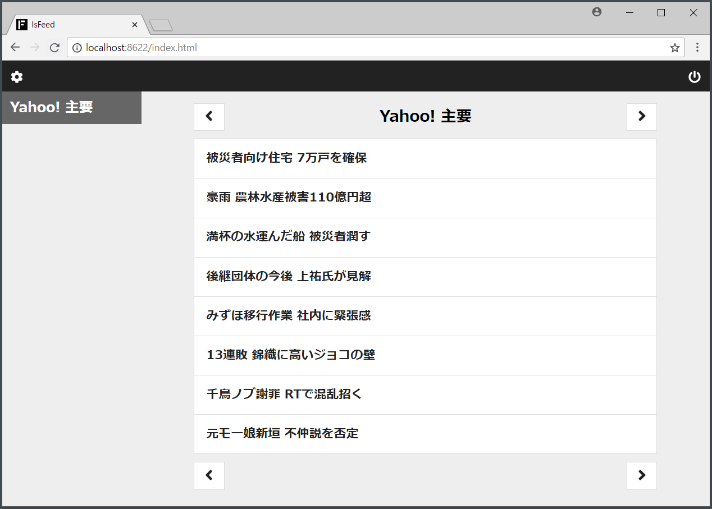

## 1. 初回利用方法
### 1.1. アプリの起動
lsFeed をインストールしたフォルダを開いて、その中に入っている `lsFeed.exe` を実行します。

初回実行時だけ、Windows の保護画面が出てしまいます。



上の画面で詳細情報をクリックすると実行ボタンが表示されます。



実行ボタンを押して頂けるとアプリが起動します。


### 1.2. フィードの登録
アプリが起動すると、ブラウザに空っぽの閲覧画面が表示されます。



初回利用時はフィードが登録されていないため、画面左上の歯車ボタンを押して設定画面に遷移します。



それから、画面左上の「＋」ボタンを押してフィードを登録します。



タイトルは任意で、URL はフィード（XML）のアドレスを指定します。

```
例）
- Title：Yahoo! 主要
- URL：https://news.yahoo.co.jp/pickup/rss.xml
```

登録できたら、設定画面左上の「<」ボタンを押して元の画面に戻ります。


### 1.3. フィードの閲覧
元の画面に戻ると登録したフィードを閲覧することができます。




### 1.4. アプリの終了
画面（ブラウザのタブ）を閉じると終了します（推奨）。

完全に終了したい場合は、閲覧画面右上の電源ボタンをクリックします。電源ボタンの詳細は、ドキュメント「[閲覧画面](./reading-feeds.md)」に記載しています。
