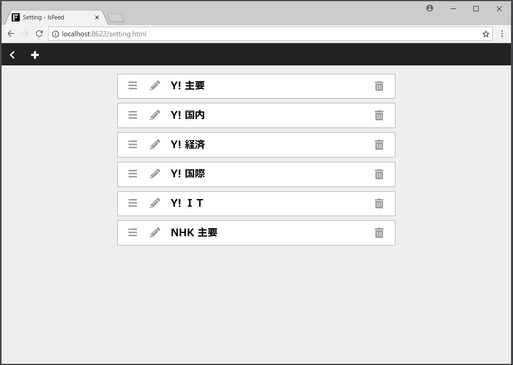

## 3. フィードの設定方法
設定画面に遷移すると、購読するフィードの設定ができます。

具体的には、フィードの、

- 追加
- 削除
- 編集
- 並び替え

をすることができます。

### 3.1. 設定画面の詳細
#### 戻るボタン（ヘッダー左）
ボタン `<` をクリックすると、フィードを閲覧する画面に戻ります。

#### プラスボタン（ヘッダー左）
モーダルウィンドウが開いて、購読するフィードを追加することができます。

#### フィードの一覧（中心）
購読しているフィードのタイトルが一覧で表示されます。各タイトルには以下のアイコンが付いていて、

- ゴミ箱：クリックで削除
- 鉛筆：クリックで編集
- バー：ドラッグ＆ドロップで並び替え

といった感じで、フィードの設定ができます。

### 3.2. 設定画面の仕様
複数の設定画面（ブラウザのタブなど）から設定を変えた場合、最後に設定した内容が有効になります。後勝ちです。
