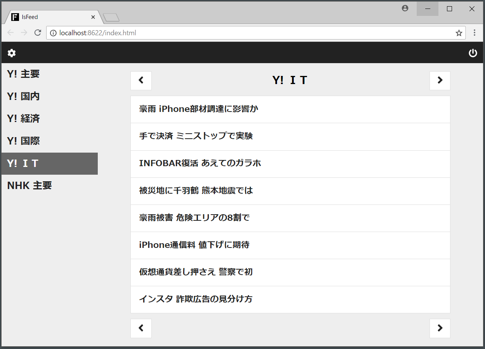

## 2. フィードの閲覧方法
アプリ（`lsFeed.exe`）を起動すると、フィードを閲覧することができます。

何も表示されない場合は、設定画面で購読するフィードを設定します。

### 2.1. 閲覧画面の詳細
#### 歯車ボタン（ヘッダー左）
クリックすると設定画面に遷移します。購読するフィードなどが設定できます、

#### サイドバー（左）
購読するフィードのタイトルが表示されます。クリックすると、そのフィードの内容が右側に表示されます。

#### ナビゲーションボタン（右上下）
クリックすると、フィードの内容が表示されます。

- `<`：前のフィード
- `>`：次のフィード

#### フィードの内容（右）
記事の見出しが８件表示されます。見出しをクリックすると、別のタブで記事（別サイトのページ）を開きます。

#### 電源ボタン（ヘッダー右）
アプリのプロセスを終了することができます（※）。電源ボタンをクリックした後は、ブラウザのタブを閉じて頂ければ大丈夫です。

※ 普段は電源ボタンを押さず、ブラウザのタブを閉じて頂ければ大丈夫です。lsFeed を起動すると、フィードを取得するためのプロセスが常駐します。プロセスは数MBの小さなもので、ブラウザでフィードを読んだり設定するときだけ動きます。
