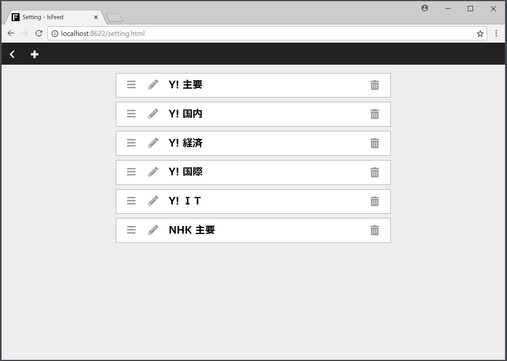

## 3. フィードの設定方法
設定画面に遷移すると、閲覧するフィードの設定ができます。

具体的には、フィードの、

- 追加
- 削除
- 編集
- 並び替え

をすることができます。

### 3.1. 設定画面の詳細
#### 3.1.1. 戻るボタン（ヘッダー左）
`<` をクリックすると、[閲覧画面](./reading-feeds.md) に戻ります。

#### 3.1.2. プラスボタン（ヘッダー左）
閲覧するフィードを追加できます。

#### 3.1.3. フィードの一覧（中心）
閲覧対象のフィードタイトルが表示されて、

- ゴミ箱：クリックで削除
- 鉛筆：クリックで編集
- バー：ドラッグ＆ドロップで並び替え

アイコンで上記の操作ができます。

### 3.2. 設定画面の仕様
設定は後勝ちです。

複数の画面（タブなど）で設定を変えると、最後の設定が有効になります。
